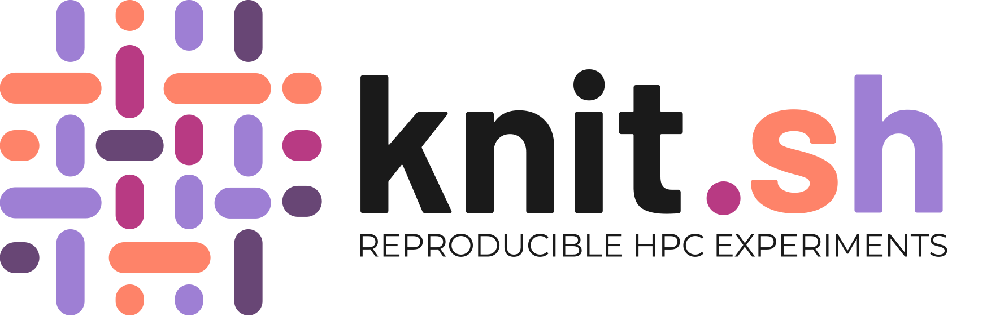
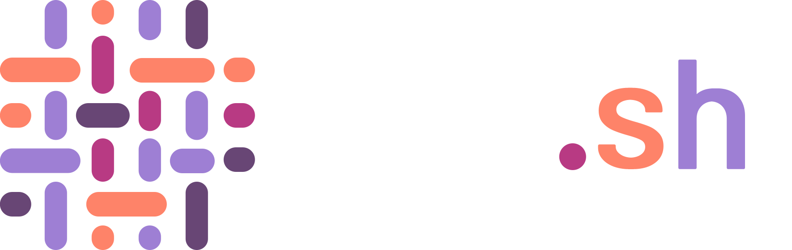

Knit
====

Knit is a Bash framework for writing reproducible and portable HPC
(High-Performance Computing) experiments. It turns an ordinary shell script into
a self-documenting CLI whose every run is recorded, so results can be traced,
repeated, and moved from a laptop to a supercomputer without changing the code.

Objectives
----------

**Simplicity.** Write experiments as plain Bash: register a function as a
command, declare its typed parameters, and Knit gives you a complete CLI ---
``--help``, validation, and logging --- for free.

**Reproducibility.** Every invocation is recorded --- its parameters, outputs,
timing, and the environment it ran in --- so an experiment can be replayed and
its results tied back to exactly how they were produced.

**Portability.** The same experiment script runs unchanged on your laptop and on
an HPC cluster; Knit detects the scheduler and MPI launcher, so only the machine
differs, never the code.

**Provenance.** Knit records *how* each result came to be --- which submission
ran which job, which job launched which run, which setup built the software ---
as a queryable graph you can trace after the fact.

The experimental model
----------------------

A Knit experiment moves through five stages. Each stage records what it did into
the database, so a later stage --- and a later reader --- can pick up exactly
what an earlier one produced::

    bootstrap  ──►  create .knit/, the SQLite database, and the tools Knit needs
        │
        ▼
    setup      ──►  build a reproducible software environment once (a git build,
        │           modules, or a Spack environment), to be reused by later stages
        │
        ▼
    submit     ──►  queue a batch job on the scheduler — or run it locally when
        │           there is no scheduler — recording its state and hosts
        │
        ▼
    run        ──►  launch a parallel (MPI) app across the job's nodes; each
        │           rank sees where it fits, and rank 0 records the run
        │
        ▼
    analyze    ──►  read every recorded run back out, aggregate the results, and
                    report — a command you write, on top of what the stages recorded

The first three stages are always present; ``run`` appears once an experiment
launches parallel apps, and ``analyze`` is the read-only analysis command you
write on top of everything the earlier stages recorded.

Getting started
---------------

New to Knit? The :doc:`quickstart` writes and runs a one-command experiment in a
few minutes, and the :doc:`tutorial/index` grows a single real experiment from a
plain command into a Spack-backed, MPI-parallel, recorded workload.

The API is split by visibility, following Knit's underscore naming convention:
names without a leading underscore form the stable :doc:`api/public`, while
names with one or two leading underscores form the :doc:`api/private`, which may
change at any time.

.. toctree::
   :maxdepth: 1
   :caption: Guides

   quickstart
   tutorial/index
   basic/index

.. toctree::
   :maxdepth: 1
   :caption: API Reference

   api/public
   api/private
